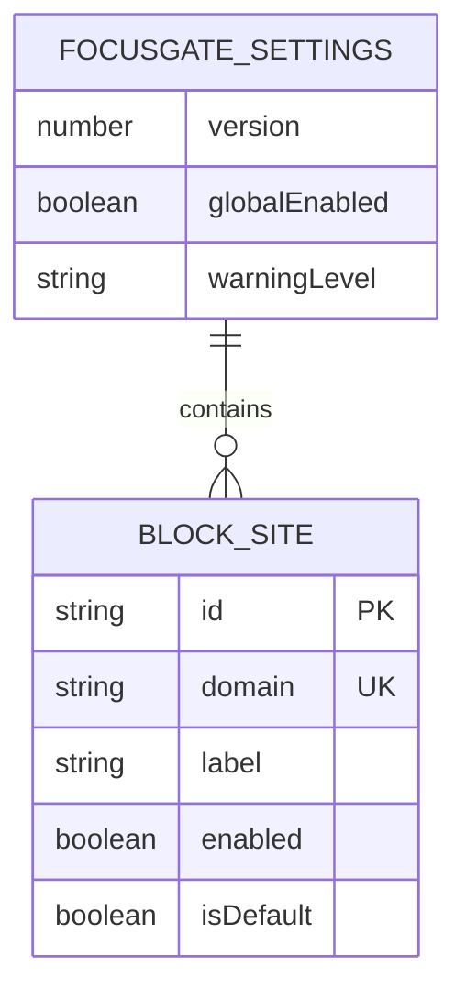
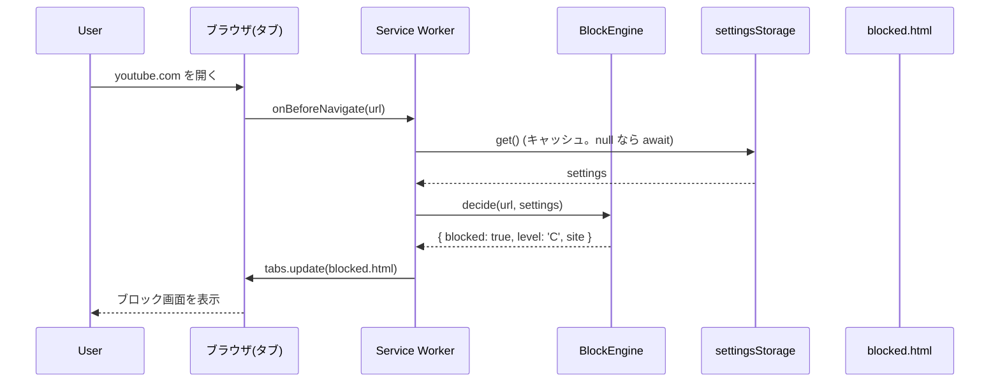
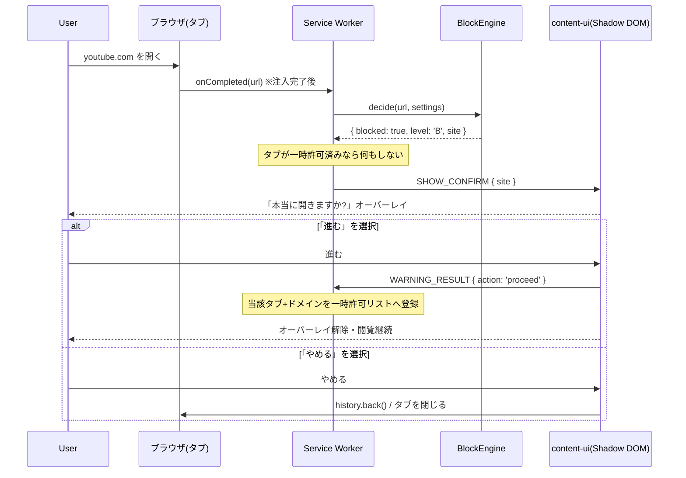
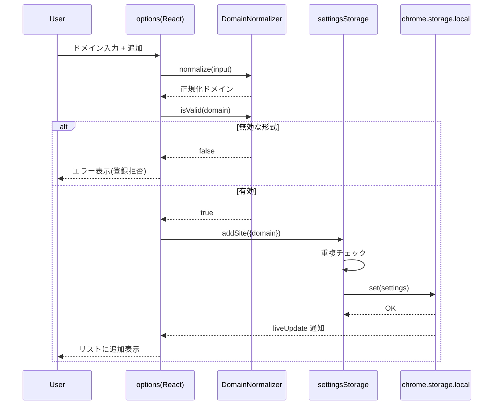
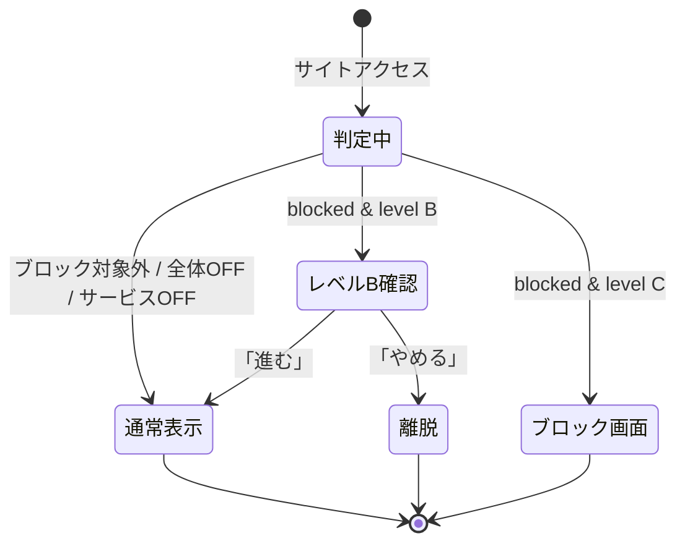
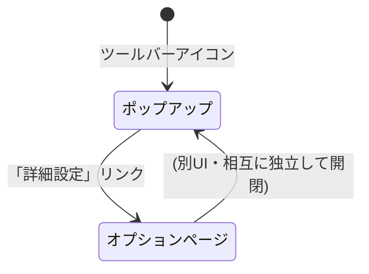

# 機能設計書 (Functional Design Document)

本書は [プロダクト要求定義書](./product-requirements.md) で定義した FocusGate の MVP 要件を、技術的にどう実現するかを詳細化したものである。対象は Chrome 拡張機能(Manifest V3)。

> **前提**: 本リポジトリは chrome-extension-boilerplate-react-vite ベースの **pnpm + Turborepo + React 19** モノレポである。各コンポーネントの配置・命名は [リポジトリ構造定義書](./repository-structure.md)、技術選定は [アーキテクチャ設計書](./architecture.md) に従う。本書の「設定ストレージ」はボイラープレートの `createStorage` パターン(`@extension/storage`)で実現し、純粋ロジックは `@extension/block-engine` に置く。

## システム構成図

FocusGate は Chrome 拡張機能の標準構成(Service Worker + UI ページ + Content Script)を、モノレポの共有パッケージ上に実装する。

```mermaid
graph TB
    User[ユーザー]

    subgraph UI[UIレイヤー pages/*・React]
        Popup[popup<br/>全体ON/OFF・警告レベル・サービスON/OFF]
        Options[options<br/>ブロックリスト追加・編集・削除]
        ContentUI[content-ui<br/>レベルB 確認オーバーレイ・Shadow DOM]
        BlockPage[blocked.html<br/>レベルC ブロック画面]
    end

    subgraph Logic[ロジックレイヤー]
        SW[Service Worker<br/>chrome-extension/src/background]
        BlockEngine["@extension/block-engine<br/>BlockEngine・DomainNormalizer"]
    end

    subgraph DataLayer[データレイヤー]
        SettingsStore["@extension/storage<br/>focusgate-settings-storage<br/>(createStorage)"]
        Storage[(chrome.storage.local)]
    end

    User --> Popup
    User --> Options
    User --> ContentUI

    Popup --> SettingsStore
    Options --> SettingsStore
    SW --> BlockEngine
    SW --> SettingsStore
    SW -.webNavigation/監視.-> ContentUI
    SW -.レベルC: tabs.update.-> BlockPage
    SettingsStore --> Storage
    Storage -. liveUpdate/onChanged .-> SW
    Storage -. liveUpdate/onChanged .-> Popup
    Storage -. liveUpdate/onChanged .-> Options
```

### 各レイヤーの役割

| レイヤー | 構成要素(実パス) | 役割 |
|---------|---------|------|
| UI | `pages/popup` / `pages/options` / `pages/content-ui` / `chrome-extension/public/blocked.html` | ユーザー操作の受付と状態表示・オーバーレイ描画(React) |
| ロジック | `chrome-extension/src/background` / `@extension/block-engine` | ナビゲーション監視・ブロック判定 |
| データ | `@extension/storage`(`focusgate-settings-storage`) / `chrome.storage.local` | 設定の永続化と変更購読(`createStorage` + `liveUpdate`) |

## 技術スタック

| 分類 | 技術 | 選定理由 |
|------|------|----------|
| プラットフォーム | Chrome 拡張機能 (Manifest V3) | PRD要件。Service Worker ベース |
| 言語 | TypeScript 5.8 | 型安全性により設定データ構造・メッセージングのバグを防止 |
| UI | React 19 + TailwindCSS | ボイラープレートが採用済み。ポップアップは軽量に保ち 200ms 要件を担保 |
| ビルド | Vite 6 + Turborepo + pnpm | ボイラープレートのモノレポ構成。各ページ/パッケージを Turbo で集約ビルド |
| ストレージ | `chrome.storage.local`(`createStorage` 経由) | ローカル完結・再起動後も保持・`liveUpdate`(onChanged)で変更通知 |
| ナビゲーション監視 | chrome.webNavigation / chrome.tabs | URL 遷移を捕捉してブロック判定。**`webNavigation` は manifest に追加が必要** |
| テスト | WebDriverIO(E2E・既存) / Vitest(ユニット・`block-engine` に追加) | 純粋ロジックは Vitest、シナリオは既存 WDIO |

> **UI 方針**: 初版は「バニラ TS」を想定していたが、実リポジトリは React 19 を採用済みのため **React で実装**する(詳細は [アーキテクチャ設計書](./architecture.md))。

## データモデル定義

設定全体を1つのルートオブジェクト `FocusGateSettings` として `chrome.storage.local` に保存する。型・定数は `@extension/block-engine/lib/types.ts`・`constants.ts` に定義し、`@extension/storage` の設定ストレージから参照する。

```typescript
// 警告レベル: 全体共通で1つだけ持つ(2段階)
type WarningLevel = 'B' | 'C';
// B: 確認ワンクッション(確認後に進める) / C: 完全ブロック(別画面に置換)

interface BlockSite {
  id: string;             // UUID v4(crypto.randomUUID)。リスト操作の識別子
  domain: string;         // 正規化済みドメイン(例: "youtube.com")。小文字・先頭www除去・スキーム無し
  label: string | null;   // 表示名(例: "YouTube")。未設定は null(JSON 永続化のため undefined ではなく null で統一)
  enabled: boolean;       // このサービス個別の ON/OFF
  isDefault: boolean;     // 初期ブロックリスト由来か(UI上の区別・誤削除防止の参考に使用)
}

interface FocusGateSettings {
  version: number;            // スキーマバージョン(マイグレーション用)。初期は 1
  globalEnabled: boolean;     // 全体 ON/OFF。デフォルト true
  warningLevel: WarningLevel; // 全体共通の警告レベル。デフォルト 'B'
  sites: BlockSite[];         // ブロック対象サイト一覧
}
```

**制約**:
- `domain` は正規化後の形式で一意(重複登録は不可)。
- `domain` は有効なドメイン形式(`example.com` 等)であること。スキーム(`http://`)・パス・空白を含まない。
- `warningLevel` は全体で1つ。サービス個別には持たない(PRD準拠)。
- `sites` の各要素の `id` は一意。

### 初期値(初回起動時のシード)

`@extension/block-engine/lib/constants.ts` に定義し、`createStorage` のデフォルト値として渡す(初回は自動でこの値が保存される)。

```typescript
const DEFAULT_SETTINGS: FocusGateSettings = {
  version: 1,
  globalEnabled: true,
  warningLevel: 'B',
  sites: [
    { id: '<uuid>', domain: 'youtube.com',   label: 'YouTube',   enabled: true, isDefault: true },
    { id: '<uuid>', domain: 'tiktok.com',    label: 'TikTok',    enabled: true, isDefault: true },
    { id: '<uuid>', domain: 'instagram.com', label: 'Instagram', enabled: true, isDefault: true },
    { id: '<uuid>', domain: 'facebook.com',  label: 'Facebook',  enabled: true, isDefault: true },
  ],
};
```

### データ関連図

設定はリレーショナルではなく単一ドキュメント構造だが、論理的な包含関係を示す。



## コンポーネント設計

### 設定ストレージ(データレイヤー / `@extension/storage`)

**配置**: `packages/storage/lib/impl/focusgate-settings-storage.ts`

**責務**:
- `chrome.storage.local` への設定の読み書きを `createStorage` で抽象化する。
- 初回起動時に `DEFAULT_SETTINGS` でシードする(`createStorage` のデフォルト値機能)。
- `liveUpdate: true` により全コンテキストへ変更を通知する(`subscribe`)。

**実装方針**: ボイラープレート標準の `createStorage` ファクトリ(`example-theme-storage.ts` と同型)で基盤を作り、FocusGate 固有のサイト操作を補助関数として付与する。機能設計上「`SettingsRepository`」と呼ぶ概念は、この**ストレージオブジェクト + 補助関数**として実現する(クラスではない)。

```typescript
import { createStorage, StorageEnum } from '../base/index.js';
import { DEFAULT_SETTINGS, STORAGE_KEY } from '@extension/block-engine';
import type { FocusGateSettings, BlockSite } from '@extension/block-engine';

const base = createStorage<FocusGateSettings>(STORAGE_KEY, DEFAULT_SETTINGS, {
  storageEnum: StorageEnum.Local,
  liveUpdate: true,
});

export const settingsStorage = {
  ...base, // get / set / subscribe / getSnapshot

  // 部分更新(globalEnabled, warningLevel 等)。sites は専用関数経由に限定する
  setGlobalEnabled: (enabled: boolean) =>
    base.set(s => ({ ...s, globalEnabled: enabled })),
  setWarningLevel: (level: FocusGateSettings['warningLevel']) =>
    base.set(s => ({ ...s, warningLevel: level })),

  // サイト操作(正規化・重複チェックは DomainNormalizer / 内部で実施)
  addSite: (input: { domain: string; label?: string | null }) => base.set(/* ... */),
  updateSite: (id: string, patch: Partial<Pick<BlockSite, 'domain' | 'label' | 'enabled'>>) => base.set(/* ... */),
  removeSite: (id: string) => base.set(s => ({ ...s, sites: s.sites.filter(x => x.id !== id) })),
};
```

> **`sites` の直接置換を避ける**: 設定の `sites` 配列はバリデーション(正規化・重複チェック)を経る `addSite`/`updateSite`/`removeSite` 経由でのみ更新する。`globalEnabled`/`warningLevel` は専用セッターで更新する。

**依存関係**:
- `@extension/storage` の `createStorage` 基盤
- `@extension/block-engine`(`DEFAULT_SETTINGS` / `STORAGE_KEY` / 型 / `DomainNormalizer`)

### DomainNormalizer(`@extension/block-engine/lib/domain-normalizer.ts`)

**責務**:
- 入力ドメインの正規化(小文字化、`http://`/`https://`/パス/前後空白の除去、先頭 `www.` 除去)。
- 形式バリデーション。

**インターフェース**:
```typescript
class DomainNormalizer {
  // 入力を正規化(例: " https://www.YouTube.com/feed " -> "youtube.com")
  static normalize(input: string): string;

  // 正規化後の値が有効なドメイン形式かを判定
  static isValid(domain: string): boolean;
}
```

### BlockEngine(`@extension/block-engine/lib/block-engine.ts`)

**責務**:
- 与えられた URL と現在の設定から、ブロックすべきか・どの警告レベルかを判定する純粋ロジック。
- 副作用を持たない(`chrome.*` 非依存・他パッケージ非依存の最下層。テスト容易)。

**インターフェース**:
```typescript
type BlockDecision =
  | { blocked: false }
  | { blocked: true; level: WarningLevel; site: BlockSite };

class BlockEngine {
  // URL と設定から判定する
  static decide(url: string, settings: FocusGateSettings): BlockDecision;

  // URL のホストが対象サイトにマッチするか(ドメイン部分一致)
  static matchSite(url: string, sites: BlockSite[]): BlockSite | null;
}
```

**判定アルゴリズムは後述の「アルゴリズム設計」を参照。**

### Service Worker(`chrome-extension/src/background/`)

**責務**:
- `chrome.webNavigation` でナビゲーションを監視し、BlockEngine で判定、レベルに応じて振り分ける。
- 設定をメモリキャッシュし、`settingsStorage.subscribe`(liveUpdate)で更新。
- レベルB で「進む」を選んだタブを一時許可リストに登録(再発動防止)。

**ナビゲーションイベントの使い分け(重要)**:
| レベル | 使用イベント | 理由 |
|--------|-------------|------|
| C(完全ブロック) | `onBeforeNavigate` | ページ描画前に `chrome.tabs.update` でリダイレクトでき、対象ページを表示させない |
| B(確認オーバーレイ) | `onCompleted` | オーバーレイは content script が**注入済み**である必要がある。`onBeforeNavigate` 時点では未注入でメッセージ送信が失敗するため、ロード完了後の `onCompleted` で発火する |

> レベルC を `onBeforeNavigate` で遮断し、B を `onCompleted` で介入する2段構えとする。判定自体は両イベントで `BlockEngine.decide` を呼び、結果のレベルに応じて適切なイベント側でのみ作用する実装とする。

**SW 再起動時のキャッシュ未構築フォールバック**: SW は非永続のため、イベント受信時にキャッシュが `null` なら `settingsStorage.get()` を `await` してから判定する(初回のみ storage I/O を許容、以降はキャッシュ参照)。

**インターフェース(主要ハンドラ・擬似シグネチャ)**:
```typescript
function onBeforeNavigate(details): Promise<void>;   // レベルC リダイレクト
function onCompleted(details): Promise<void>;        // レベルB 確認オーバーレイ指示
function onSettingsChanged(settings): void;          // キャッシュ更新(subscribe)
function onMessageFromContent(msg, sender, sendResponse): void; // 確認結果の受信・許可登録
function onTabRemoved(tabId): void;                  // 許可リストから削除
```

**依存関係**: `@extension/block-engine`, `@extension/storage`(settingsStorage)

### Content Script / content-ui(`pages/content-ui`)

**責務**:
- レベル B: 「本当に開きますか?」確認オーバーレイを表示。「進む」で解除し SW に通知(タブ一時許可)、「やめる」で離脱(`history.back()` / タブを閉じる)。
- Service Worker からのメッセージを受けて **React + Shadow DOM** でオーバーレイを描画(対象ページの CSS と分離。`init-app-with-shadow` を利用)。

**依存関係**: Service Worker(メッセージング)、`@extension/ui`

### Popup / Options(`pages/popup`, `pages/options`)

**責務**:
- Popup: 全体 ON/OFF、警告レベル(B/C)、サービス個別 ON/OFF の表示と切替。
- Options: ブロックリストの追加・編集・削除。
- いずれも `@extension/storage`(settingsStorage)経由で読み書きし、`useStorage`(`@extension/shared` のフック)で購読して相互整合を保つ。

## アルゴリズム設計

### ブロック判定アルゴリズム(BlockEngine.decide)

**目的**: アクセス先 URL と現在の設定から、ブロック要否と警告レベルを決定する。

**計算ロジック**:

#### ステップ1: 全体フラグ判定
- `settings.globalEnabled === false` の場合 → `{ blocked: false }` を返して終了。

#### ステップ2: 対象サイトのマッチング(ドメイン部分一致)
- URL からホスト名を抽出(`new URL(url).hostname`)。失敗(`chrome://` 等の非 http スキーム)時は `{ blocked: false }`。
- ホスト名を正規化(小文字化・先頭 `www.` 除去)。
- 各 `site` について、`site.enabled === true` かつ ホスト名が `site.domain` に**ドメイン部分一致**するものを探す。
  - 部分一致の定義: ホスト名が `site.domain` と完全一致、または `"." + site.domain` で終端する。
    - 例: `site.domain = "youtube.com"` のとき、`youtube.com` / `m.youtube.com` / `music.youtube.com` はマッチ。`notyoutube.com` はマッチしない(`.youtube.com` で終わらないため)。
- マッチする `site` が無ければ → `{ blocked: false }`。

#### ステップ3: 警告レベルの付与
- マッチした場合 → `{ blocked: true, level: settings.warningLevel, site }` を返す。

**実装例**:
```typescript
class BlockEngine {
  static decide(url: string, settings: FocusGateSettings): BlockDecision {
    if (!settings.globalEnabled) return { blocked: false };

    const site = this.matchSite(url, settings.sites);
    if (!site) return { blocked: false };

    return { blocked: true, level: settings.warningLevel, site };
  }

  static matchSite(url: string, sites: BlockSite[]): BlockSite | null {
    let host: string;
    try {
      host = new URL(url).hostname.toLowerCase().replace(/^www\./, '');
    } catch {
      return null; // 非対応スキームや不正URL
    }

    for (const site of sites) {
      if (!site.enabled) continue;
      const d = site.domain.toLowerCase();
      if (host === d || host.endsWith('.' + d)) {
        return site;
      }
    }
    return null;
  }
}
```

### ドメイン正規化アルゴリズム(DomainNormalizer.normalize)

**目的**: ユーザー入力を一貫した形式に揃え、重複・誤マッチを防ぐ。

**手順**:
1. 前後の空白を除去。
2. スキーム(`https://`, `http://`)が付いていれば URL として解釈し `hostname` を取り出す。付いていなければ最初の `/` 以降(パス)を除去。
3. 小文字化。
4. 先頭の `www.` を除去。
5. 末尾のドット・ポートを除去。

**バリデーション(isValid)**:
- ラベル(`.` 区切り)が1つ以上あり、各ラベルが英数字とハイフンのみ、TLD が2文字以上。
- 例(有効): `youtube.com`, `sub.example.co.jp`
- 例(無効): 空文字, `youtube`(TLD無し), `http://`(ホスト無し), 空白を含む文字列

## ユースケース図

### ユースケース1: ブロック対象サイトへのアクセス(レベルC = 完全ブロック)



### ユースケース2: ブロック対象サイトへのアクセス(レベルB = 確認ワンクッション)



### ユースケース3: カスタムサイトの追加(オプションページ)



## 画面遷移図

### ナビゲーション時の状態遷移(警告レベル別)



### UI 画面構成



## メッセージング設計(拡張機能内通信)

Service Worker と Content Script / UI 間は `chrome.runtime` メッセージで通信する。

| メッセージ種別 | 送信元 → 送信先 | ペイロード | 用途 |
|--------------|----------------|-----------|------|
| `SHOW_CONFIRM` | SW → content-ui | `{ site }` | レベルB の確認オーバーレイ表示指示 |
| `WARNING_RESULT` | content-ui → SW | `{ action: 'proceed'\|'cancel' }` | レベルBの確認結果。`proceed` で当該タブ+ドメインを一時許可 |

> 設定の相互整合は、原則 `settingsStorage` の `liveUpdate`(= `chrome.storage.onChanged`)を各コンテキストで購読することで実現し、明示的メッセージは UI 介入(オーバーレイ)に限定する。

### レベルB「進む」後の再発動防止(タブ一時許可)

レベルB で「進む」を選んだ後、同一タブ内の遷移で再び確認が出るのを防ぐため、SW は **「タブID → 許可済みドメイン」のインメモリマップ**を保持する。
- `WARNING_RESULT { proceed }` 受信時に登録。
- 判定時、当該タブで許可済みドメインなら介入しない(`blocked` でも素通し)。
- `chrome.tabs.onRemoved` でタブが閉じられたら、またはドメインが変わったらマップから削除。
- SW 非永続のためマップは揮発するが、許可は「同一閲覧セッション内の利便性」目的であり、揮発しても安全側(再度確認が出るだけ)に倒れる。

## UI設計

### ポップアップ

**表示・操作項目**:
| 項目 | 説明 | UI |
|------|------|-----|
| 全体 ON/OFF | マスタースイッチ | トグルスイッチ |
| 警告レベル | B / C の選択 | セグメント or ラジオ |
| サービス一覧 | 登録サイトごとの ON/OFF | 各行にトグル |
| 詳細設定 | オプションページを開く | リンク/ボタン |

**カラーコーディング**:
- ON 状態: 緑(アクティブ)
- OFF 状態: グレー(非アクティブ)
- 警告レベル C(完全ブロック)選択時: 赤系のアクセント(抑止の強さを示唆)

### オプションページ

**表示項目(ブロックリスト)**:
| 項目 | 説明 | フォーマット |
|------|------|-------------|
| ラベル | 表示名 | 文字列(編集可) |
| ドメイン | 正規化済みドメイン | 文字列(編集可) |
| 状態 | サービス ON/OFF | トグル |
| 操作 | 編集 / 削除 | ボタン |

**操作フロー(追加)**:
1. 入力欄にドメインを入力。
2. 「追加」ボタン押下 → 正規化・バリデーション。
3. 有効ならリストに追加、無効ならエラーメッセージ表示。

### ブロック画面(レベルC / `chrome-extension/public/blocked.html`)

- SW が `chrome.tabs.update` で当該タブを `blocked.html` にリダイレクト(`web_accessible_resources` に登録)。
- 集中を促すメッセージ(例: 「集中中です。このサイトはブロックされています」)と対象サイト名を表示(対象サイトは URL クエリ等で受け渡し)。
- 装飾は最小限・刺激の少ないトーン。
- **履歴ループ対策**: リダイレクトで `blocked.html` が履歴に積まれ、戻るボタンで対象サイト↔ブロック画面を往復しないよう、`chrome.tabs.update` 後に対象 URL を履歴から除外するか、ブロック画面側で「前のページに戻る/タブを閉じる」導線のみ提供する。

## ファイル構造(データ保存)

`chrome.storage.local` に単一キーで保存する。

**保存キー**: `focusgate:settings`

**保存値の例**:
```json
{
  "version": 1,
  "globalEnabled": true,
  "warningLevel": "B",
  "sites": [
    { "id": "a1b2...", "domain": "youtube.com", "label": "YouTube", "enabled": true, "isDefault": true },
    { "id": "c3d4...", "domain": "tiktok.com", "label": "TikTok", "enabled": false, "isDefault": true },
    { "id": "e5f6...", "domain": "example.com", "label": null, "enabled": true, "isDefault": false }
  ]
}
```

### SPA クライアントサイド遷移の扱い

`onBeforeNavigate` / `onCompleted` はフルページ遷移を捕捉するが、YouTube Shorts 等の `pushState`/`replaceState` による SPA 内遷移は捕捉しない。**MVP では SPA 内遷移のブロックはスコープ外**(初回アクセス遮断で PRD のコアバリューは達成)。Post-MVP で `chrome.webNavigation.onHistoryStateUpdated` の追加を検討する。

## パフォーマンス最適化

- **設定のメモリキャッシュ**: Service Worker 起動時に設定を読み込みキャッシュ。`settingsStorage.subscribe`(liveUpdate)で更新し、ナビゲーション毎の storage 読み込みを回避(判定 50ms 以内)。未構築時は `get()` を await(フォールバック)。
- **判定の早期リターン**: 全体 OFF・非 http スキームは最優先で除外。
- **サイト数を考慮した線形探索**: 登録数は通常数十件規模のため線形探索で十分。大量登録時はドメイン → site のハッシュマップ化を将来検討。
- **軽量UI**: ポップアップは React の初期化を軽量に保ち(重い同期処理を避ける)、200ms 以内の表示を担保。

## セキュリティ考慮事項

- **ローカル完結**: 設定・閲覧データを外部送信しない(`chrome.storage.local` のみ)。ネットワーク権限は不要。
- **権限**: 既存の `storage`/`tabs`/`scripting` に加え、ナビゲーション監視のため **`webNavigation` を manifest に追加**する。`host_permissions: <all_urls>` は動的ブロックリストのため必要だが、介入は `blocked: true` のときのみに限定し影響範囲を最小化(詳細は [アーキテクチャ設計書](./architecture.md))。
- **入力サニタイズ**: ユーザー入力ドメインは正規化・バリデーションを通す。UI 反映は React の標準レンダリングを用い、`dangerouslySetInnerHTML` を使わない。
- **Content Script の影響範囲**: オーバーレイは Shadow DOM で対象ページと分離し、判定で対象と確定したページにのみ描画する。

## エラーハンドリング

| エラー種別 | 処理 | ユーザーへの表示 |
|-----------|------|-----------------|
| 不正ドメイン入力 | 登録を中断 | 「正しいドメイン形式で入力してください(例: youtube.com)」 |
| 重複ドメイン登録 | 登録を中断 | 「このサイトは既に登録されています」 |
| storage 読み込み失敗 | 初期値で継続 | (UI上は初期状態で起動。コンソールに警告ログ) |
| storage 保存失敗 | 変更を反映せず通知 | 「設定の保存に失敗しました。再度お試しください」 |
| URL 解析失敗(非httpスキーム等) | ブロック対象外として通常遷移 | (表示なし。誤ブロックを防ぐ) |

## テスト戦略

> ユニットテスト基盤(Vitest)は未導入のため、`@extension/block-engine` に追加する。E2E は既存の WebDriverIO(`tests/e2e/`)を使用する(詳細は [開発ガイドライン](./development-guidelines.md))。

### ユニットテスト(Vitest・`@extension/block-engine` に追加)
- `BlockEngine.decide` / `matchSite`: 全体OFF、サービスOFF、ドメイン部分一致(`m.youtube.com` ○ / `notyoutube.com` ×)、非httpスキーム。`chrome` モック不要(純粋関数)。
- `DomainNormalizer.normalize` / `isValid`: スキーム付き・www付き・パス付き・大文字・無効形式。
- 設定ストレージのサイト操作(`addSite` の重複拒否 / `updateSite` / `removeSite`): `chrome.storage` をモック。

### 統合テスト
- 設定変更(Popup での全体OFF)→ liveUpdate → SW キャッシュ更新 → 次回ナビゲーションで非ブロックになること。
- オプションでのサイト追加 → ポップアップのサービス一覧に反映されること(相互整合)。

### E2Eテスト(WebDriverIO・`tests/e2e/specs/`)
- レベルB: 確認が出て「進む」で閲覧、「やめる」で離脱。「進む」後に同一タブで再発動しないこと。
- レベルC: ブロック画面(`blocked.html`)に置き換わる。
- 全体OFF時にすべての対象サイトが素通しになる。
