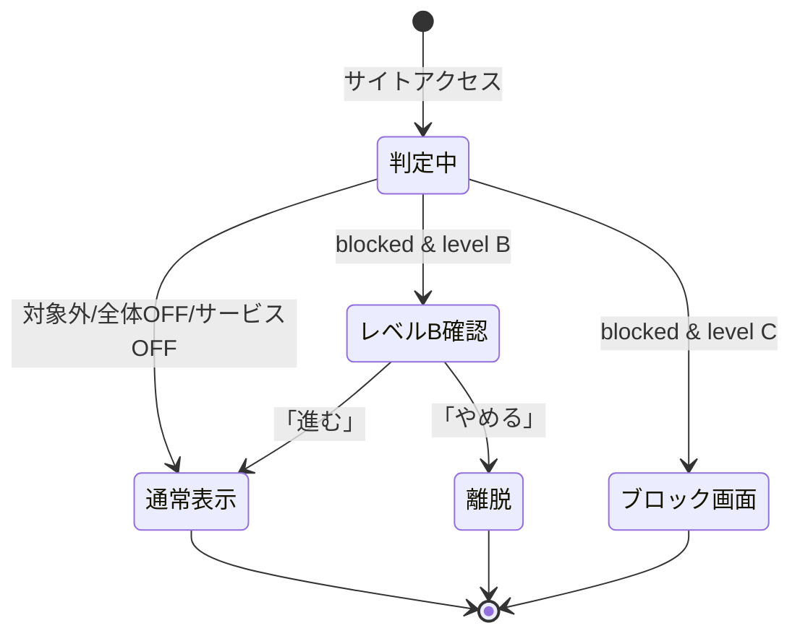

# プロジェクト用語集 (Glossary)

## 概要

このドキュメントは、FocusGate プロジェクト内で使用される用語の定義を管理します。各ドキュメント([PRD](./product-requirements.md) / [機能設計書](./functional-design.md) / [アーキテクチャ設計書](./architecture.md) / [リポジトリ構造定義書](./repository-structure.md) / [開発ガイドライン](./development-guidelines.md))で使用される用語を統一的に定義します。

**更新日**: 2026-06-16

## ドメイン用語

プロジェクト固有のビジネス概念や機能に関する用語。

### FocusGate

**定義**: 集中を妨げるサイトへのアクセスを「関所(Gate)」で制御する集中支援 Chrome 拡張機能。

**説明**: 勉強・開発などに集中したい人が、無意識のうちに YouTube や SNS を開いてしまう癖を矯正することを目的とする。名前は Focus(集中)+ Gate(門・関所)に由来する。

**関連用語**: [ブロック対象サイト](#ブロック対象サイト), [警告レベル](#警告レベル), [関所](#関所-gate)

**英語表記**: FocusGate

### 関所 (Gate)

**定義**: 集中を妨げるサイトへのアクセスを制御する仕組みのメタファー。

**説明**: ユーザーが集中阻害サイトを開こうとした「アクセスのタイミング」で介入し、気づきや抑止を与える。物理的な遮断だけでなく、警告や確認といった段階的な制御を含む。

**関連用語**: [ブロック](#ブロック-block), [警告レベル](#警告レベル)

### ブロック対象サイト

**定義**: ブロックや警告の対象として登録されたサイト。ドメイン単位で管理される。

**説明**: 初期状態では YouTube・TikTok・Instagram・Facebook が登録済み。ユーザーは任意のドメインを追加・編集・削除できる。データモデル上は [BlockSite](#blocksite) として表現される。マッチングはドメイン部分一致で行われ、サブドメインも対象に含まれる。

**関連用語**: [BlockSite](#blocksite), [ドメイン部分一致](#ドメイン部分一致), [初期ブロックリスト](#初期ブロックリスト)

**使用例**:
- 「youtube.com をブロック対象サイトに追加する」
- 「ブロック対象サイトの ON/OFF を切り替える」

**データモデル**: `packages/block-engine/lib/types.ts`(`BlockSite`)

### 初期ブロックリスト

**定義**: 初回インストール時にあらかじめ登録されているブロック対象サイトの集合。

**説明**: YouTube・TikTok・Instagram・Facebook の4サイト。ユーザーが追加設定をしなくてもすぐに利用を開始できるようにする。`DEFAULT_SETTINGS` に定義され、`isDefault: true` のフラグを持つ。

**関連用語**: [ブロック対象サイト](#ブロック対象サイト), [DEFAULT_SETTINGS](#default_settings)

### 警告レベル

**定義**: ブロック発動時の抑止の強さを示す、プロダクト全体で共通の2段階設定。

**説明**: サービス個別ではなく全体で1つの値(`WarningLevel`)を持つ。デフォルトはレベル B。当初は「レベル A(警告のみ)」を含む3段階だったが、A は抑止効果が弱く無視されやすいため廃止し、B/C の2段階とした。

**取りうる値**:

| レベル | 名称 | 挙動 |
|--------|------|------|
| B | 確認ワンクッション | 「本当に開きますか?」と確認し、ボタンを押せば進める(衝動に一拍置く) |
| C | 完全ブロック | ページを表示させず、別画面(ブロック画面)に置き換える(物理的に遮断) |

**関連用語**: [ブロック画面](#ブロック画面), [ブロック判定](#ブロック判定), [WarningLevel](#warninglevel)

**使用例**:
- 「警告レベルを C に変更する」
- 「集中したいときはレベル C、確認だけ挟みたいときは B にする」

### ブロック (Block)

**定義**: ブロック対象サイトへのアクセス時に、警告レベルに応じた介入(通知/確認/遮断)を行うこと。

**説明**: 発動条件は「全体フラグが ON」かつ「対象サービスのフラグが ON」。いずれかが OFF の場合は発動しない。

**関連用語**: [ブロック判定](#ブロック判定), [全体 ON/OFF](#全体-onoff), [サービス ON/OFF](#サービス-onoff)

### 全体 ON/OFF

**定義**: FocusGate 全体のブロック機能を有効/無効にするマスタースイッチ。

**説明**: `globalEnabled` に対応。OFF のときは、サービス個別設定にかかわらず一切ブロックが発動しない。

**関連用語**: [サービス ON/OFF](#サービス-onoff), [ブロック判定](#ブロック判定)

### サービス ON/OFF

**定義**: 登録されたブロック対象サイト(サービス)ごとにブロックを有効/無効にする設定。

**説明**: `BlockSite.enabled` に対応。全体が ON かつ当該サービスが ON のときのみ、そのサイトでブロックが発動する。

**関連用語**: [全体 ON/OFF](#全体-onoff), [BlockSite](#blocksite)

### ブロック画面

**定義**: 警告レベル C(完全ブロック)時に、対象ページの代わりに表示される別画面。

**説明**: 集中を促すメッセージと対象サイト名を表示する。`chrome-extension/public/blocked.html`(`web_accessible_resources`)に実装され、Service Worker が `chrome.tabs.update` でリダイレクトして表示する。

**関連用語**: [警告レベル](#警告レベル), [Service Worker](#service-worker), [オーバーレイ](#オーバーレイ-overlay)

### オーバーレイ (Overlay)

**定義**: 警告レベル B の発動時に、対象ページの上に重ねて表示する確認 UI。

**説明**: content-ui が React + Shadow DOM でページに注入して描画する(対象ページの CSS と分離)。レベル B は「本当に開きますか?」確認を表示し「進む」/「やめる」を求める。レベル C の[ブロック画面](#ブロック画面)(別ページ置換)とは異なり、元のページ上に表示される。

**実装箇所**: `pages/content-ui/`

**関連用語**: [Content Script](#content-script), [警告レベル](#警告レベル), [ブロック画面](#ブロック画面)

### ポップアップ (Popup)

**定義**: ツールバーアイコンから開く簡易操作 UI。

**説明**: 全体 ON/OFF、警告レベル(B/C)、サービス個別 ON/OFF を素早く切り替える。`pages/popup/`(React)に実装。

**関連用語**: [オプションページ](#オプションページ-options-page)

### オプションページ (Options Page)

**定義**: ブロックリストの追加・編集・削除など詳細設定を行う UI。

**説明**: `pages/options/`(React)に実装。ポップアップとは設定が相互に整合する(`settingsStorage` の `liveUpdate` 経由)。

**関連用語**: [ポップアップ](#ポップアップ-popup), [設定ストレージ](#設定ストレージ-settings-storage)

## アーキテクチャ用語

### ドメイン部分一致

**定義**: URL のホスト名が登録ドメインと完全一致、または `"." + 登録ドメイン` で終端する場合にマッチとみなす判定方式。

**説明**: 登録ドメインのサブドメインも対象に含めるための方式。`youtube.com` の登録で `m.youtube.com`・`music.youtube.com` はマッチし、`notyoutube.com` はマッチしない。

**本プロジェクトでの適用**: `BlockEngine.matchSite` で `host === d || host.endsWith('.' + d)` により実装。

**関連コンポーネント**: [BlockEngine](#blockengine)

**使用例**:
```
登録: youtube.com
マッチ:   youtube.com / m.youtube.com / music.youtube.com
非マッチ: notyoutube.com / youtube.com.evil.com
```

### ブロック判定

**定義**: 遷移先 URL と現在の設定から、ブロック要否と適用する警告レベルを決定する処理。

**説明**: ①全体フラグ判定 → ②対象サイトのドメイン部分一致 → ③警告レベル付与、の順で評価する純粋ロジック。`BlockEngine.decide` が `BlockDecision` を返す。

**本プロジェクトでの適用**: `packages/block-engine/lib/block-engine.ts`(`@extension/block-engine`)

**関連用語**: [BlockEngine](#blockengine), [BlockDecision](#blockdecision), [ドメイン部分一致](#ドメイン部分一致)

### レイヤードアーキテクチャ (Layered Architecture)

**定義**: システムを役割ごとの層に分け、上位層から下位層への一方向の依存に限定する設計パターン。

**本プロジェクトでの適用**: UI(pages/popup・options・content-ui)→ サービス(`@extension/block-engine`)→ データ(`@extension/storage`)→ chrome.storage の一方向依存。共有ロジックは `packages/*` に集約し、各実行コンテキストから再利用する。

**依存関係のルール**:
- ✅ UI → サービス → データ
- ❌ データ → サービス / UI
- ❌ UI → chrome.storage 直接アクセス(必ず `@extension/storage` 経由)

**関連コンポーネント**: [設定ストレージ](#設定ストレージ-settings-storage), [BlockEngine](#blockengine)

**参考資料**: [アーキテクチャ設計書](./architecture.md), [リポジトリ構造定義書](./repository-structure.md)

### 実行コンテキスト

**定義**: Chrome 拡張機能においてブラウザが分離管理する実行環境(Service Worker / ポップアップ / オプション / Content Script / ブロック画面)。

**説明**: コンテキスト間は直接 import できず、`chrome.runtime` メッセージングや `chrome.storage` の `liveUpdate`(onChanged)を介して連携する。共有コード(`packages/*` = `@extension/*`)はビルド時に各コンテキストへバンドルされ再利用される。

**関連用語**: [Service Worker](#service-worker), [Content Script](#content-script), [メッセージング](#メッセージング)

### メッセージング

**定義**: 実行コンテキスト間で `chrome.runtime` を介してデータをやり取りする仕組み。

**説明**: Service Worker → content-ui の確認オーバーレイ表示指示(`SHOW_CONFIRM`)などに使用。設定の相互整合は原則 `settingsStorage` の `liveUpdate`(onChanged)購読で実現し、メッセージングは UI 介入に限定する。

**本プロジェクトでの適用**: `chrome-extension/src/background/` と `pages/content-ui/` 間の `chrome.runtime` メッセージ。

**関連用語**: [実行コンテキスト](#実行コンテキスト), [Content Script](#content-script)

## コンポーネント / データモデル用語

### BlockEngine

**定義**: ブロック判定を行う純粋ロジックのコンポーネント。

**主要メソッド**:
- `decide(url, settings): BlockDecision`: ブロック要否と警告レベルを判定。
- `matchSite(url, sites): BlockSite | null`: ドメイン部分一致するサイトを返す。

**説明**: `chrome.*` を参照せず設定を引数で受け取るため、単体テストが容易。型(`types`)のみに依存し、他パッケージには依存しない最下層(循環回避)。

**実装箇所**: `packages/block-engine/lib/block-engine.ts`(`@extension/block-engine`)

**関連用語**: [ブロック判定](#ブロック判定), [BlockDecision](#blockdecision)

### 設定ストレージ (Settings Storage)

**定義**: `chrome.storage.local` への設定の読み書きを抽象化するデータレイヤー。機能設計上「SettingsRepository」と呼ぶ概念に相当。

**実現方法**: ボイラープレートの `createStorage` ファクトリ(`@extension/storage`)で基盤を作り、FocusGate 固有のサイト操作を補助関数として付与する(クラスではない)。`get` / `set` / `subscribe` + `setGlobalEnabled` / `setWarningLevel` / `addSite` / `updateSite` / `removeSite`。

**説明**: 初回起動時に `DEFAULT_SETTINGS` でシード(createStorage のデフォルト値)、`liveUpdate: true` で変更購読を提供。storage への全アクセスをここに集約し、UI/background からの直接アクセスを禁止する。

**実装箇所**: `packages/storage/lib/impl/focusgate-settings-storage.ts`

**関連用語**: [chrome.storage.local](#chromestoragelocal), [DEFAULT_SETTINGS](#default_settings), [STORAGE_KEY](#storage_key)

### DomainNormalizer

**定義**: 入力ドメインの正規化と形式バリデーションを行うユーティリティ。

**主要メソッド**:
- `normalize(input): string`: スキーム/パス/空白/先頭 `www.` を除去し小文字化(例: ` https://www.YouTube.com/feed ` → `youtube.com`)。
- `isValid(domain): boolean`: 正規化後の値が有効なドメイン形式かを判定。

**実装箇所**: `packages/block-engine/lib/domain-normalizer.ts`(`@extension/block-engine`)

**関連用語**: [ブロック対象サイト](#ブロック対象サイト), [ValidationError](#バリデーションエラー-validation-error)

### FocusGateSettings

**定義**: FocusGate の全設定を保持するルートデータモデル。

**主要フィールド**:
- `version`: スキーマバージョン(マイグレーション用、初期値 1)。
- `globalEnabled`: 全体 ON/OFF(デフォルト true)。
- `warningLevel`: 全体共通の警告レベル(デフォルト 'B')。
- `sites`: ブロック対象サイト一覧(`BlockSite[]`)。

**制約**: `chrome.storage.local` の単一キー `focusgate:settings` に JSON で保存。

**関連エンティティ**: [BlockSite](#blocksite)

**データモデル**: `packages/block-engine/lib/types.ts`

### BlockSite

**定義**: 個々のブロック対象サイトを表すデータモデル。

**主要フィールド**:
- `id`: UUID v4(`crypto.randomUUID`)。リスト操作の識別子。
- `domain`: 正規化済みドメイン(一意)。
- `label`: 表示名(`string | null`。未設定は `null`)。
- `enabled`: サービス個別 ON/OFF。
- `isDefault`: 初期ブロックリスト由来かどうか。

**制約**: `domain` は正規化後の形式で一意(重複登録不可)。

**関連エンティティ**: [FocusGateSettings](#focusgatesettings)

**データモデル**: `packages/block-engine/lib/types.ts`

### WarningLevel

**定義**: 警告レベルを表す型エイリアス。

**取りうる値**: `'B' | 'C'`(詳細は[警告レベル](#警告レベル)を参照)。

**データモデル**: `packages/block-engine/lib/types.ts`

### BlockDecision

**定義**: ブロック判定の結果を表す型。

**説明**: 判別可能なユニオン型。
```typescript
type BlockDecision =
  | { blocked: false }
  | { blocked: true; level: WarningLevel; site: BlockSite };
```

**関連用語**: [BlockEngine](#blockengine), [ブロック判定](#ブロック判定)

### DEFAULT_SETTINGS

**定義**: 初回起動時に適用される初期設定の定数。

**説明**: 全体 ON、警告レベル B、初期ブロックリスト(YouTube/TikTok/Instagram/Facebook)を含む。保存済み設定が存在しない場合、`createStorage` のデフォルト値としてこれが保存される。

**実装箇所**: `packages/block-engine/lib/constants.ts`

**関連用語**: [初期ブロックリスト](#初期ブロックリスト), [設定ストレージ](#設定ストレージ-settings-storage), [STORAGE_KEY](#storage_key)

### STORAGE_KEY

**定義**: `chrome.storage.local` への保存時に使用するキー名の定数。

**値**: `'focusgate:settings'`

**実装箇所**: `packages/block-engine/lib/constants.ts`

**関連用語**: [chrome.storage.local](#chromestoragelocal), [設定ストレージ](#設定ストレージ-settings-storage)

## ステータス・状態

### ナビゲーション時の状態遷移

**定義**: サイトアクセス時に、ブロック判定結果と警告レベルに応じて遷移する画面状態。

| 状態 | 意味 | 遷移条件 |
|------|------|---------|
| 通常表示 | 通常通りページを表示 | ブロック対象外 / 全体OFF / サービスOFF |
| レベルB確認 | 確認オーバーレイを表示 | blocked かつ level B |
| ブロック画面 | 別画面に置換 | blocked かつ level C |

**状態遷移図**:


**関連用語**: [警告レベル](#警告レベル), [ブロック判定](#ブロック判定)

## エラー・例外

### バリデーションエラー (Validation Error)

**クラス名**: `ValidationError`

**継承元**: `Error`

**発生条件**: ユーザー入力が不正な場合に発生。主に不正なドメイン形式の入力、重複ドメインの登録。

**対処方法**:
- ユーザー: エラーメッセージに従って入力を修正(例: 「正しいドメイン形式で入力してください(例: youtube.com)」)。
- 開発者: `DomainNormalizer` のバリデーションロジックを確認。

**ログレベル**: WARN(ユーザー起因)

**実装箇所**: `packages/block-engine/lib/validation-error.ts`(`@extension/block-engine`)、利用は `pages/options` UI 等。

**使用例**:
```typescript
if (!DomainNormalizer.isValid(domain)) {
  throw new ValidationError('正しいドメイン形式で入力してください', 'domain', domain);
}
```

**関連用語**: [DomainNormalizer](#domainnormalizer), [ブロック対象サイト](#ブロック対象サイト)

## 技術用語

### Chrome 拡張機能 (Chrome Extension)

**定義**: Google Chrome の機能を拡張するためのプログラム。

**公式サイト**: https://developer.chrome.com/docs/extensions

**本プロジェクトでの用途**: FocusGate 自体の形態。ポップアップ・オプションページ・Service Worker・Content Script で構成される。

**関連ドキュメント**: [アーキテクチャ設計書](./architecture.md)

### Manifest V3 (MV3)

**正式名称**: Manifest Version 3

**定義**: Chrome 拡張機能の最新の仕様バージョン。Service Worker ベースのバックグラウンド処理、強化された CSP などが特徴。

**公式サイト**: https://developer.chrome.com/docs/extensions/develop/migrate

**本プロジェクトでの用途**: FocusGate が準拠する拡張機能仕様。`manifest.ts` で宣言。`eval`・インライン script を使用できない制約に従う。

**関連用語**: [Service Worker](#service-worker), [manifest.json](#manifestjson)

### Service Worker

**定義**: MV3 における拡張機能のバックグラウンド処理を担う、イベント駆動で非永続なスクリプト。

**説明**: アイドル時に停止し、イベント発生時に再起動する。そのため状態をメモリに常駐させず、`@extension/storage` を真実の源として起動時にキャッシュを再構築する(未構築時は `get()` を await)。FocusGate ではナビゲーション監視・ブロック判定の振り分けを担う。

**本プロジェクトでの用途**: `chrome-extension/src/background/`(エントリ `index.ts`、判定振り分け `navigation.ts`)

**関連用語**: [Manifest V3 (MV3)](#manifest-v3-mv3), [chrome.webNavigation](#chromewebnavigation)

### Content Script

**定義**: 対象ウェブページのコンテキストで実行されるスクリプト。

**説明**: FocusGate では警告レベル B の確認オーバーレイを React + Shadow DOM で対象ページ上に描画する。Service Worker からのメッセージ(`onCompleted` 後)を受けて動作する。

**本プロジェクトでの用途**: `pages/content-ui/`(オーバーレイ)/ `pages/content/`・`pages/content-runtime/`(注入)

**関連用語**: [メッセージング](#メッセージング), [警告レベル](#警告レベル), [オーバーレイ](#オーバーレイ-overlay)

### chrome.storage.local

**定義**: 拡張機能のデータをローカルに永続保存する Chrome API。

**説明**: FocusGate の全設定をローカルに保存する(外部送信なし)。ブラウザ再起動後も保持され、`onChanged`(ボイラープレートでは `liveUpdate`)で各コンテキストへ変更を通知できる。アクセスは `@extension/storage` の設定ストレージに集約する。

**本プロジェクトでの用途**: 設定の永続化(キー `focusgate:settings`)。

**関連用語**: [設定ストレージ](#設定ストレージ-settings-storage), [FocusGateSettings](#focusgatesettings)

### chrome.webNavigation

**定義**: ブラウザのナビゲーション(ページ遷移)イベントを監視する Chrome API。

**説明**: レベルC は `onBeforeNavigate`(描画前リダイレクト)、レベルB は `onCompleted`(content script 注入後にオーバーレイ)で遷移を捕捉し、ブロック判定の起点とする。判定はクリティカルパス上のため軽量に保つ。**この権限は現状の manifest に未宣言のため追加が必要**。SPA 内遷移(`pushState` 等)は捕捉しない(MVPスコープ外)。

**本プロジェクトでの用途**: `chrome-extension/src/background/` でのナビゲーション監視。

**関連用語**: [Service Worker](#service-worker), [ブロック判定](#ブロック判定), [chrome.tabs](#chrometabs)

### chrome.tabs

**定義**: ブラウザのタブを操作する Chrome API。

**説明**: FocusGate では警告レベル C 時に `chrome.tabs.update` でタブの URL を `blocked.html` に書き換えるために使用する。Service Worker から呼び出す。`tabs` 権限は manifest に宣言済み。

**本プロジェクトでの用途**: `chrome-extension/src/background/` でのブロック画面リダイレクト。

**関連用語**: [Service Worker](#service-worker), [ブロック画面](#ブロック画面)

### manifest.json

**定義**: Chrome 拡張機能の構成を宣言するマニフェストファイル。

**説明**: Service Worker・ポップアップ(action)・オプションページ・Content Script・権限・`host_permissions` などを宣言する。本リポジトリでは TS で記述(`manifest.ts`)。現状の権限は `storage`/`scripting`/`tabs`/`notifications`/`sidePanel`、`host_permissions: ['<all_urls>']`。FocusGate では **`webNavigation` の追加**と `web_accessible_resources` への `blocked.html` 追加が必要。

**本プロジェクトでの用途**: `chrome-extension/manifest.ts`。

**関連用語**: [Manifest V3 (MV3)](#manifest-v3-mv3)

### TypeScript

**定義**: JavaScript に静的型付けを追加したプログラミング言語。

**公式サイト**: https://www.typescriptlang.org/

**本プロジェクトでの用途**: 全ソースコードの実装言語。`packages/tsconfig/base.json` を継承し型を保証する。

**バージョン**: 5.8.x

**設定ファイル**: `tsconfig.json`(ルート)/ 各ワークスペースの `tsconfig.json`

### React

**定義**: 宣言的な UI 構築のための JavaScript ライブラリ。

**公式サイト**: https://react.dev/

**本プロジェクトでの用途**: 各 UI ページ(popup/options/content-ui 等)の実装。ボイラープレートが採用済み。

**バージョン**: 19.1.x

### Vite

**定義**: 高速なフロントエンドビルドツール。

**公式サイト**: https://vitejs.dev/

**本プロジェクトでの用途**: 各ページ/パッケージのビルド・バンドル。Turborepo + pnpm で集約。

**バージョン**: 6.3.x

**設定ファイル**: 各ワークスペースの `vite.config.mts`

### Turborepo

**定義**: モノレポのタスク実行・キャッシュを最適化するビルドシステム。

**公式サイト**: https://turbo.build/repo

**本プロジェクトでの用途**: `pnpm build`/`dev`/`type-check`/`lint`/`e2e` を各ワークスペースに集約実行。

**バージョン**: 2.5.x

**設定ファイル**: `turbo.json`

### WebDriverIO

**定義**: ブラウザ自動化による E2E テストフレームワーク。

**公式サイト**: https://webdriver.io/

**本プロジェクトでの用途**: `tests/e2e/` の E2E テスト(既存)。FocusGate のシナリオ(警告レベル等)を追加する。

### Vitest

**定義**: Vite と統合されたテストフレームワーク。

**公式サイト**: https://vitest.dev/

**本プロジェクトでの用途**: 純粋ロジック(`@extension/block-engine`)のユニットテスト。**未導入のため追加する**。`BlockEngine` は純粋関数のため `chrome` モック不要。

**バージョン**: 導入時に確定

**関連ドキュメント**: [開発ガイドライン](./development-guidelines.md#テスト戦略)

## 略語・頭字語

### PRD

**正式名称**: Product Requirements Document

**意味**: プロダクト要求定義書。何を作るかを定義する。

**本プロジェクトでの使用**: [docs/product-requirements.md](./product-requirements.md)

### MVP

**正式名称**: Minimum Viable Product

**意味**: 実用最小限の製品。プロダクトとして成立する最小機能セット。

**本プロジェクトでの使用**: P0 機能(ブロックリスト管理/発動/警告レベル/ON-OFF/保存/UI)が MVP の範囲。

**関連用語**: [Post-MVP](#post-mvp)

### Post-MVP

**意味**: MVP に含めず、後から追加する将来機能。

**本プロジェクトでの使用**: スケジュール機能、設定同期、パス単位ブロック、ブロック回数記録など。

**関連用語**: [MVP](#mvp)

### MV3

[Manifest V3 (MV3)](#manifest-v3-mv3) を参照。

### UUID

**正式名称**: Universally Unique Identifier

**意味**: 重複しない一意な識別子。

**本プロジェクトでの使用**: `BlockSite.id` の採番。ブラウザ標準の `crypto.randomUUID()` を使用。

## 索引

### あ行
- [オーバーレイ](#オーバーレイ-overlay) - ドメイン用語
- [オプションページ](#オプションページ-options-page) - ドメイン用語

### か行
- [関所 (Gate)](#関所-gate) - ドメイン用語
- [警告レベル](#警告レベル) - ドメイン用語

### さ行
- [サービス ON/OFF](#サービス-onoff) - ドメイン用語
- [実行コンテキスト](#実行コンテキスト) - アーキテクチャ用語
- [初期ブロックリスト](#初期ブロックリスト) - ドメイン用語
- [設定ストレージ](#設定ストレージ-settings-storage) - コンポーネント

### た行
- [ドメイン部分一致](#ドメイン部分一致) - アーキテクチャ用語

### な行
- [ナビゲーション時の状態遷移](#ナビゲーション時の状態遷移) - ステータス

### は行
- [バリデーションエラー](#バリデーションエラー-validation-error) - エラー
- [ブロック (Block)](#ブロック-block) - ドメイン用語
- [ブロック画面](#ブロック画面) - ドメイン用語
- [ブロック対象サイト](#ブロック対象サイト) - ドメイン用語
- [ブロック判定](#ブロック判定) - アーキテクチャ用語
- [ポップアップ](#ポップアップ-popup) - ドメイン用語

### ま行
- [メッセージング](#メッセージング) - アーキテクチャ用語

### ら行
- [レイヤードアーキテクチャ](#レイヤードアーキテクチャ-layered-architecture) - アーキテクチャ用語

### 全体 / その他
- [全体 ON/OFF](#全体-onoff) - ドメイン用語

### A-Z
- [BlockDecision](#blockdecision) - データモデル
- [BlockEngine](#blockengine) - コンポーネント
- [BlockSite](#blocksite) - データモデル
- [Chrome 拡張機能](#chrome-拡張機能-chrome-extension) - 技術用語
- [chrome.storage.local](#chromestoragelocal) - 技術用語
- [chrome.tabs](#chrometabs) - 技術用語
- [chrome.webNavigation](#chromewebnavigation) - 技術用語
- [Content Script](#content-script) - 技術用語
- [DEFAULT_SETTINGS](#default_settings) - データモデル
- [DomainNormalizer](#domainnormalizer) - コンポーネント
- [FocusGate](#focusgate) - ドメイン用語
- [FocusGateSettings](#focusgatesettings) - データモデル
- [manifest.json](#manifestjson) - 技術用語
- [Manifest V3 (MV3)](#manifest-v3-mv3) - 技術用語
- [MVP](#mvp) - 略語
- [Post-MVP](#post-mvp) - 略語
- [PRD](#prd) - 略語
- [React](#react) - 技術用語
- [Service Worker](#service-worker) - 技術用語
- [STORAGE_KEY](#storage_key) - データモデル
- [TypeScript](#typescript) - 技術用語
- [Turborepo](#turborepo) - 技術用語
- [UUID](#uuid) - 略語
- [Vite](#vite) - 技術用語
- [Vitest](#vitest) - 技術用語
- [WarningLevel](#warninglevel) - データモデル
- [WebDriverIO](#webdriverio) - 技術用語
